# 智能体评测系统设计

## 目录

1. [背景与目标](#1-背景与目标)
2. [系统整体架构](#2-系统整体架构)
3. [核心领域模型](#3-核心领域模型)
4. [评测集设计](#4-评测集设计)
5. [标签设计](#5-标签设计)
6. [评估器设计](#6-评估器设计)
7. [评测任务执行链路](#7-评测任务执行链路)
8. [远程调用与快照设计](#8-远程调用与快照设计)
9. [状态流转与异常处理](#9-状态流转与异常处理)
10. [数据展示与指标统计](#10-数据展示与指标统计)
11. [前端交互设计](#11-前端交互设计)
12. [数据库与校验设计](#12-数据库与校验设计)
13. [工程规范与质量保障](#13-工程规范与质量保障)
14. [可扩展性设计](#14-可扩展性设计)
15. [总结](#15-总结)

> 说明：本文档中的图示优先使用 Mermaid 源码，便于在 Markdown 中直接维护、审阅和修改。若分享平台不支持 Mermaid，可以后续将这些图导出为 PNG 并统一放入 `PIC` 目录。

---

## 1. 背景与目标

智能体平台的核心价值，是让用户能够通过低代码或高代码方式构建智能体，并让智能体完成问答、推理、工具调用、知识检索、流程执行等任务。随着智能体能力变强，问题也变得更明显：智能体不像传统接口一样总是返回固定结构、固定字段、固定结果。同一个问题，在不同模型、不同 Prompt、不同知识库版本、不同工具调用链路下，可能会得到不同答案。

这就带来一个现实问题：我们怎么知道一个智能体“变好了”还是“变差了”？

举一个通俗的例子。假设有一个“大学计算机专业老师”智能体，用户问它：

> 什么是进程调度？常见的调度算法有哪些？

智能体 A 回答了定义、列举了 FCFS、SJF、时间片轮转、优先级调度，并解释了优缺点。智能体 B 只回答了一句“进程调度就是操作系统安排进程运行”。这两个回答都不是空，但质量明显不同。如果只靠人工肉眼检查，一次两次还可以，数据多起来就会有几个问题：

- 人工成本高：几百条、几千条数据逐条看，效率很低。
- 标准不稳定：不同人对“好答案”的理解不完全一样。
- 难以复现：今天评估通过，不代表明天换了模型、换了智能体版本后还能通过。
- 难以统计：没有统一结果结构，就难以算整体通过率、单个评估维度通过率、失败分布。

智能体评测系统要解决的就是这类问题。它不是一个简单的“跑测试用例”工具，而是一套围绕智能体输出质量建立的评测工作台。

### 1.1 系统目标

本系统的目标可以概括为四句话：

| 目标 | 说明 | 例子 |
| --- | --- | --- |
| 标准化输入 | 用评测集管理输入数据，使每次评测基于同一批问题 | 100 道计算机基础问题 |
| 标准化评估 | 用评估器和标签定义评测维度 | 回答相关性、安全性、是否包含幻觉 |
| 自动化执行 | 自动调用智能体和模型评估器，减少人工重复劳动 | 一键开始任务，系统逐行执行 |
| 可视化分析 | 展示明细、标注、通过率、进度和分布 | 指标统计页展示综合得分和失败维度 |

### 1.2 系统在智能体平台中的位置

智能体评测系统可以理解为智能体平台的“质量检测中心”。智能体平台负责创建智能体、管理模型、管理工具、管理知识库；评测系统负责拿一批标准问题去调用智能体，再判断智能体回答是否符合预期。

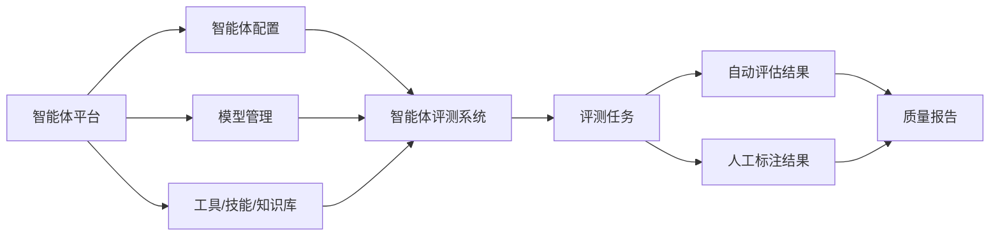

读者可以把它想成一次考试：

- 智能体是考生。
- 评测集是试卷。
- 评估器是自动阅卷规则。
- 标签是人工阅卷项。
- 评测任务是一次考试安排。
- 指标统计是成绩单。

---

## 2. 系统整体架构

系统采用典型的前后端分离设计。前端负责资源管理、任务创建、任务详情、标注操作、图表展示；后端负责业务校验、任务执行、数据库读写、远程调用智能体和模型服务；数据库负责保存评测资源、版本、绑定关系和结果数据。

### 2.1 架构分层

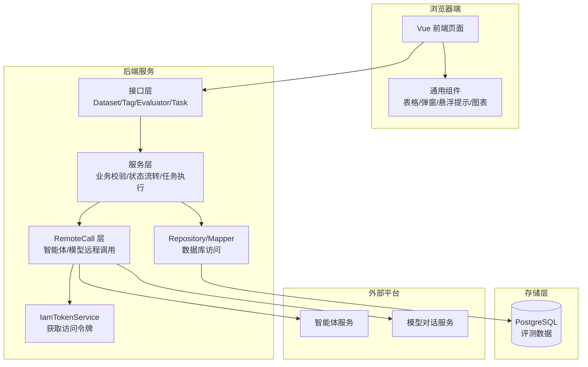

### 2.2 模块职责

| 层级 | 主要职责 | 当前系统中的体现 |
| --- | --- | --- |
| 前端页面层 | 用户操作入口，展示列表、详情、创建页、标注页 | `DatasetManagementView`、`TaskDetailView`、`TaskAnnotationView` |
| 前端组件层 | 抽取公共交互，减少重复样式和重复逻辑 | `OverflowTooltip`、`TaskTagDrawer`、`EChartView` |
| 接口层 | 接收请求、读取参数、返回统一响应 | `DatasetController`、`TagController`、`EvaluatorController`、`TaskController` |
| 服务层 | 处理业务规则、校验、状态流转 | `DatasetService`、`TagService`、`EvaluatorService`、`TaskService` |
| 持久层 | 封装数据库读写 | Repository、Mapper、XML |
| 远程调用层 | 屏蔽智能体和模型接口细节 | `RemoteCallService`、`RemoteCallProperties` |

### 2.3 为什么要单独有 RemoteCall 层

远程调用智能体和模型服务时，会遇到很多和业务无关但必须处理的问题，例如：

- 请求地址来自配置。
- 请求头需要携带 IAM token。
- 智能体可能是流式返回。
- 智能体输出可能包含 `text`、`reasoning`、`debug`、`toolCall` 等不同内容块。
- 模型评估器需要根据模型接口返回内容解析 `score` 和 `reason`。

如果这些逻辑散落在任务服务、评估器服务和前端里，后续维护会很困难。因此系统把外部平台调用集中放在 RemoteCall 层，业务层只关心“我要调用智能体”“我要调用模型”，不用关心 HTTP 细节。

---

## 3. 核心领域模型

系统的核心资源有四类：评测集、标签、评估器、评测任务。

理解这四类资源之间的关系，是理解整个系统的关键。

### 3.1 四类核心资源

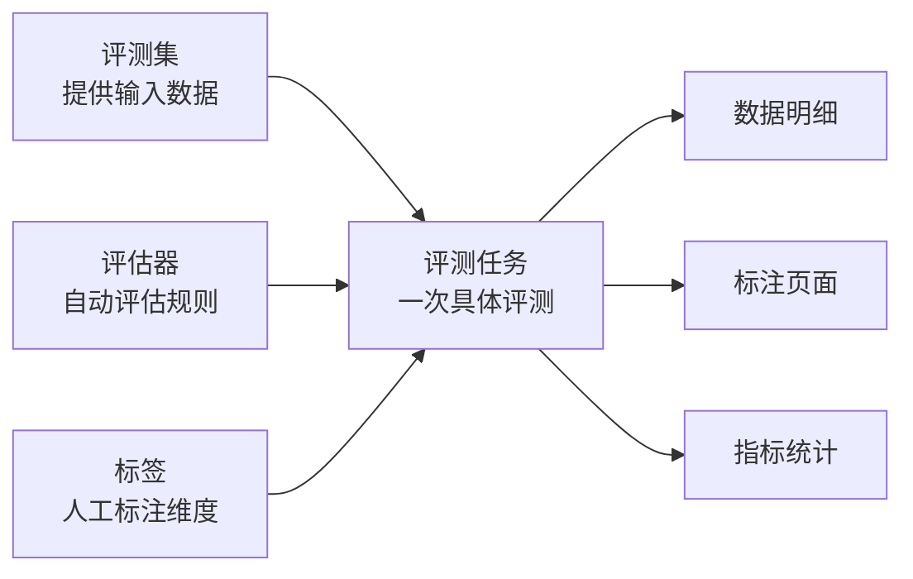

### 3.2 资源解释

| 资源 | 通俗解释 | 系统里的作用 |
| --- | --- | --- |
| 评测集 | 一套测试数据或试卷 | 存储问题、参考答案、上下文等字段 |
| 标签 | 人工打分项 | 支持人工标注文本、布尔、分类、数字结果 |
| 评估器 | 自动打分规则 | 用 LLM 判断智能体输出质量并给出得分 |
| 评测任务 | 一次评测执行记录 | 绑定评测集、智能体、评估器、标签，并保存结果 |

### 3.3 版本概念

评测集和自定义评估器有版本概念。

为什么需要版本？因为数据和规则会变。

假设今天评测集有 100 条问题，明天新增到 150 条。如果历史任务直接引用“当前评测集”，那么历史任务到底是基于 100 条跑的，还是基于 150 条跑的，就会说不清楚。评估器也是类似，Prompt 修改前后评分标准不同，如果不做版本管理，历史结果就很难解释。

因此系统对关键资源采用版本化设计：

- 评测集有草稿版本和已发布版本。
- 自定义评估器有草稿版本和已发布版本。
- 创建任务时只能绑定已发布版本。
- 任务创建后保存关键名称快照，保证历史任务展示稳定。

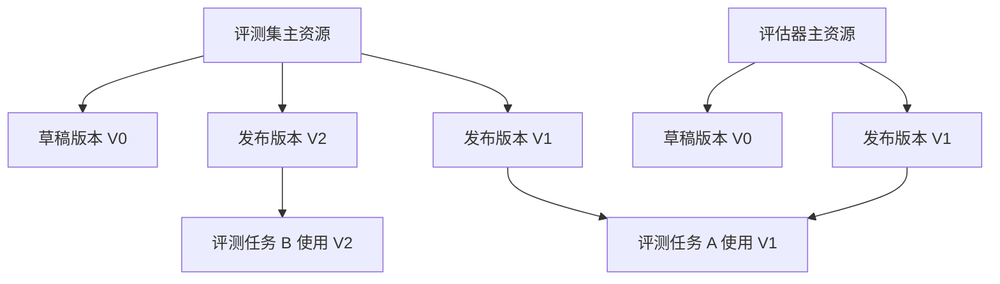

### 3.4 一个完整例子

假设我们要评测“大学计算机专业老师”智能体，可以这样配置：

| 配置项 | 示例 |
| --- | --- |
| 评测集 | 计算机基础问答集 V1 |
| 评测集字段 | `query`、`reference_response` |
| 智能体 | 大学计算机专业老师 / V1 / 默认子智能体 |
| 评估器 | 问答相关性 V1、幻觉检测 V1 |
| 标签 | 文本标签、布尔标签、分类标签 |

任务执行后，每条评测集数据会形成一条任务明细。每条明细中会有：

- 原始评测集字段值。
- 智能体输出。
- 每个评估器的结果、得分、原因。
- 每个标签的人工标注结果。

---

## 4. 评测集设计

评测集是系统里最基础的数据资源。没有评测集，就没有标准输入，也就无法进行可复现的评测。

### 4.1 评测集结构

评测集由三层组成：

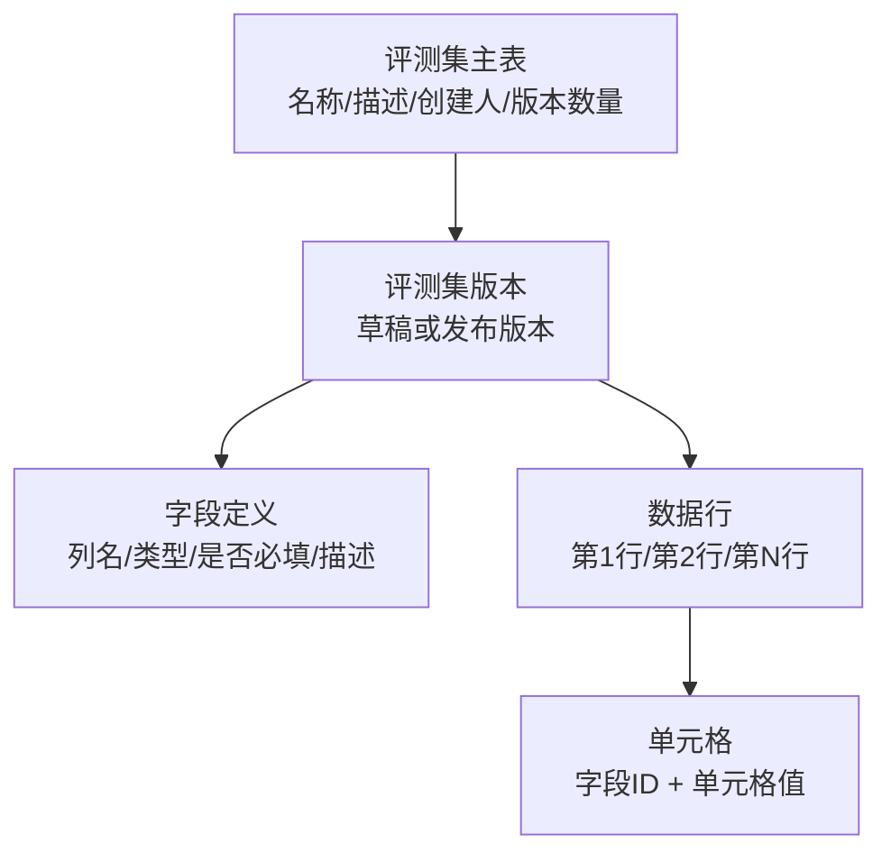

对应数据库表：

| 表 | 作用 |
| --- | --- |
| `t_eval_dataset` | 评测集主表 |
| `t_eval_dataset_version` | 评测集版本表 |
| `t_eval_dataset_field` | 评测集字段表 |
| `t_eval_dataset_item` | 评测集数据行表 |
| `t_eval_dataset_item_cell` | 评测集单元格表 |

### 4.2 为什么字段和值分表存

评测集不是固定表结构。一个评测集可能只有 `query` 一列，另一个评测集可能有 `query`、`context`、`reference_response` 三列。为了支持用户自定义列，不能在数据库里提前写死 `query`、`context` 这些字段。

因此系统采用“字段定义表 + 行表 + 单元格表”的方式：

- 字段表保存有哪些列。
- 行表保存有多少条数据。
- 单元格表保存某一行某一列的值。

这种设计更像 Excel。列可以由用户配置，数据按行列交叉保存。

### 4.3 字段类型

评测集字段目前支持三类：

| 类型 | 含义 | 示例 | 校验方式 |
| --- | --- | --- | --- |
| `string` | 文本 | “什么是死锁？” | 任意文本 |
| `number` | 数字 | `3.14`、`100` | 必须能按数字解析 |
| `boolean` | 布尔 | `TRUE`、`FALSE` | 大小写兼容输入，统一保存为大写 |

布尔类型比较容易出问题。例如用户在 Excel 中可能写 `true`、`True`、`TRUE`、`TRue`。系统会在导入和保存时统一归一化：

| 用户输入 | 后端保存 | 前端展示 |
| --- | --- | --- |
| `true` | `TRUE` | `TRUE` |
| `True` | `TRUE` | `TRUE` |
| `FALSE` | `FALSE` | `FALSE` |
| `abc` | 报错 | 不保存 |

### 4.4 Excel 导入

Excel 导入的核心逻辑是“按表头名称匹配字段”。

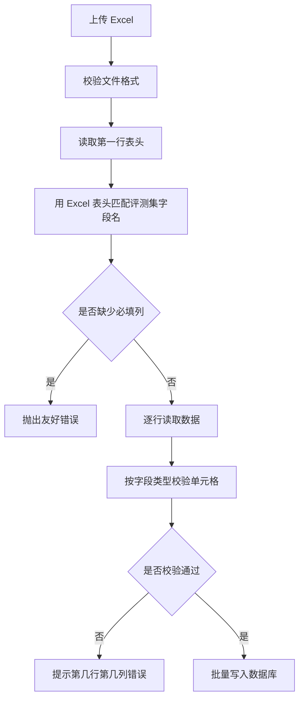

导入时的几个关键点：

- 第一行必须是表头。
- 表头名称要和评测集字段名称匹配。
- 必填字段必须在 Excel 中出现。
- 数据类型必须符合字段定义。
- 出错时要告诉用户具体是哪一行、哪一列、哪个字段有问题。

例如：

> Excel 第 12 行，第 3 列（是否正确）应为布尔值 TRUE 或 FALSE

这样的错误信息比“导入失败”更有用，因为用户可以直接定位并修复数据。

### 4.5 草稿与发布

评测集使用“草稿 + 发布版本”的模式。

| 版本类型 | 是否可编辑 | 是否可被任务绑定 | 说明 |
| --- | --- | --- | --- |
| 草稿版本 | 可以编辑 | 不可以 | 用来维护字段和数据 |
| 发布版本 | 不可以编辑 | 可以 | 用来创建评测任务 |

这样设计是为了保证任务执行时的数据稳定。如果任务绑定的是草稿，用户一边跑任务一边改数据，评测结果就会失去可信度。

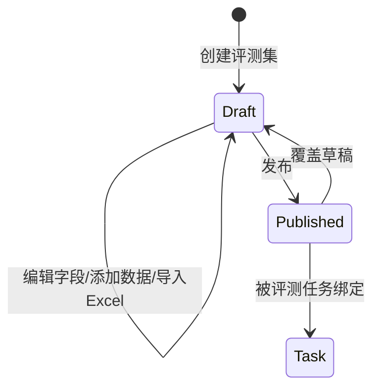

---

## 5. 标签设计

标签用于人工标注。自动评估器可以批量判断很多问题，但有些维度仍然需要人工参与，比如答案是否满足业务偏好、是否表达自然、是否符合某个特殊标准。

### 5.1 标签类型

系统支持四类标签：

| 标签类型 | 用途 | 示例 |
| --- | --- | --- |
| 文本标签 | 记录人工备注或人工答案 | “回答中缺少边界条件说明” |
| 布尔标签 | 二选一判断 | `TRUE` / `FALSE` |
| 分类标签 | 从多个选项中选择 | `优秀`、`一般`、`较差` |
| 数字标签 | 输入一个分数 | 0 到 10 分 |

### 5.2 PASS / FAIL 分组

标签最终也要参与指标统计，因此布尔、分类、数字标签都要能转换成通过或不通过。

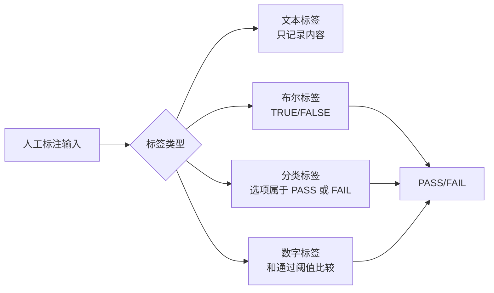

例如数字标签：

| 配置 | 用户标注 | 结果 |
| --- | --- | --- |
| 最小值 0，最大值 10，通过阈值 6 | 8 | PASS |
| 最小值 0，最大值 10，通过阈值 6 | 4 | FAIL |

### 5.3 标签绑定到任务

标签不是创建后就自动参与所有任务，而是在创建评测任务时进行绑定。任务绑定标签后，每条任务数据都会生成对应的标签结果记录。

例如一个任务有 100 条数据，绑定 3 个标签，那么理论上会有：

> 100 条数据 x 3 个标签 = 300 条标签结果

这些结果初始是待标注状态。用户在标注页面完成标注后，对应结果变为已标注，并写入标注值、PASS/FAIL、标注人和标注时间。

### 5.4 标签动态增删

任务详情页支持后续添加或移除标签。

- 添加标签：系统会给任务下每条数据生成该标签的待标注结果。
- 移除标签：系统会删除该任务下该标签对应的所有标注结果。
- 移除后状态会重新计算：如果原来唯一未完成的标签被移除，任务数据可能从待标注变为完成。

这里有一个重要边界：任务至少要保留一个评估维度，也就是至少绑定一个评估器或一个标签。否则任务就没有任何自动评估或人工标注价值。

---

## 6. 评估器设计

评估器是自动化评测的核心。它用于根据一套规则判断智能体输出是否符合预期，并输出得分和原因。

当前系统重点支持 LLM 型评估器，Code 型评估器暂时禁用或暂未接入真实执行能力。

### 6.1 评估器分类

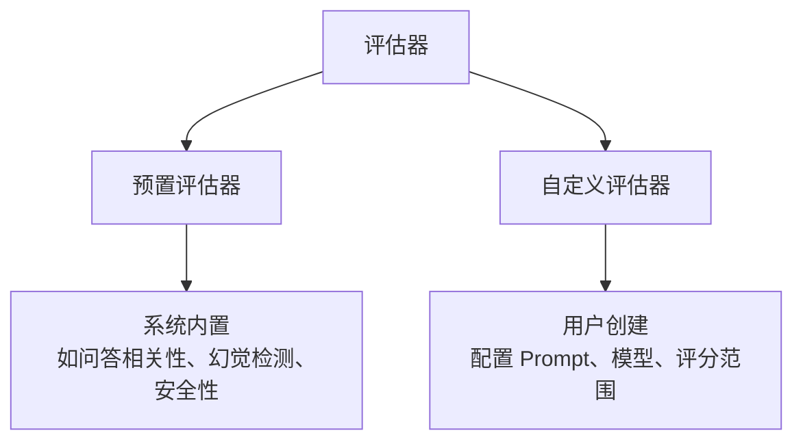

| 类型 | 来源 | 是否版本化 | 适用场景 |
| --- | --- | --- | --- |
| 预置评估器 | 系统内置 | 不走用户版本表 | 常见评估维度 |
| 自定义评估器 | 用户创建 | 有草稿和发布版本 | 业务自定义评分规则 |

### 6.2 LLM 型评估器组成

一个 LLM 型评估器通常包含：

| 配置 | 说明 |
| --- | --- |
| 评估器名称 | 用户识别这个评估器的名称 |
| 描述 | 说明评估器用途 |
| 模型 | 调用哪个模型进行评估 |
| Prompt | 给模型的评分规则 |
| 参数配置 | Prompt 中引用了哪些变量 |
| 评分范围 | 例如 0 到 5 分 |
| 通过阈值 | 例如大于等于 3 分为 PASS |

### 6.3 Prompt 参数映射

评估器 Prompt 不应该写死某条数据，而应该用变量占位。

例如：

```text
你是一名专业评估员。
请判断智能体回答是否和用户问题相关。

用户问题：${query}
智能体回答：${response}
参考答案：${reference_response}

请输出 JSON：
{"score": 5, "reason": "理由"}
```

这里的 `${query}`、`${response}`、`${reference_response}` 就是参数。创建任务时，用户需要告诉系统这些参数来自哪里：

| 参数 | 来源 |
| --- | --- |
| `query` | 评测集字段 `query` |
| `response` | 应用输出 `text` |
| `reference_response` | 评测集字段 `reference_response` |

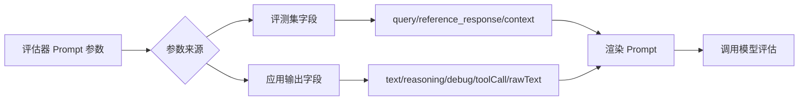

### 6.4 评估器输出解析

系统要求模型评估器输出 JSON，并且必须包含 `score` 字段。`reason` 字段用于记录评估理由。

示例输出：

```json
{
  "score": 4,
  "reason": "回答覆盖了进程调度的定义，并列举了常见算法，但缺少对适用场景的说明。"
}
```

系统解析后会进行三步处理：

1. 读取 `score`。
2. 读取 `reason`。
3. 用 `score` 和通过阈值比较，得到 PASS 或 FAIL。

例如评分范围是 0 到 5，通过阈值是 3：

| 模型返回分数 | 系统结果 |
| --- | --- |
| 5 | PASS |
| 4 | PASS |
| 3 | PASS |
| 2 | FAIL |
| 0 | FAIL |

### 6.5 试运行能力

创建评估器页面支持试运行。用户可以在保存评估器前输入一组样例参数，系统用当前页面上的配置调用模型，直接看到得分和原因。

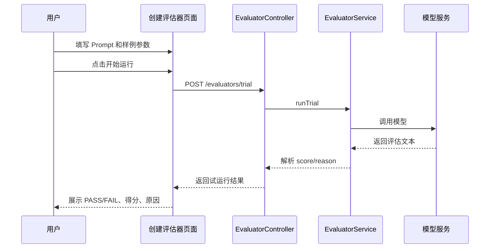

试运行的价值是降低配置成本。用户不用等创建任务、执行任务之后才知道 Prompt 写得对不对。

---

## 7. 评测任务执行链路

评测任务是把评测集、智能体、评估器、标签串起来的一次执行。

### 7.1 创建任务时发生了什么

创建任务时，用户需要选择：

- 任务名称和描述。
- 已发布评测集版本。
- 是否绑定智能体。
- 评测集字段如何映射到智能体输入。
- 绑定哪些评估器。
- 评估器参数如何映射。
- 绑定哪些标签。

后端会做业务校验，然后把这些选择固化到任务相关表中。

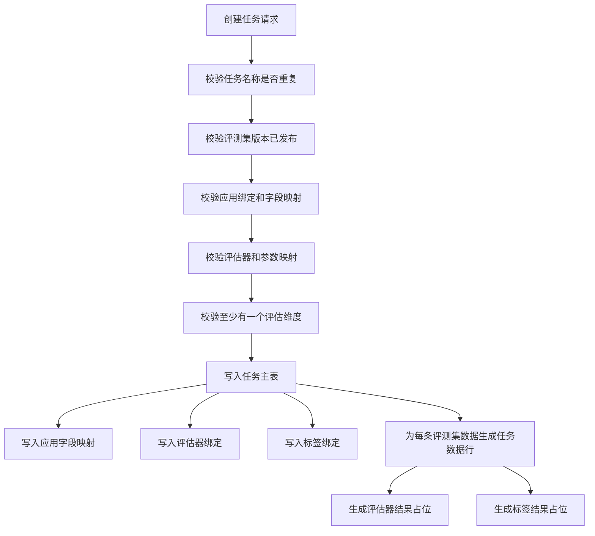

### 7.2 执行任务时发生了什么

任务开始后，系统按评测集数据逐条执行。

对每一条数据，大致分三段：

1. 准备智能体输入。
2. 调用智能体并保存输出。
3. 调用评估器并保存自动评估结果。

如果任务绑定了人工标签，还会等待用户在标注页面完成标注。

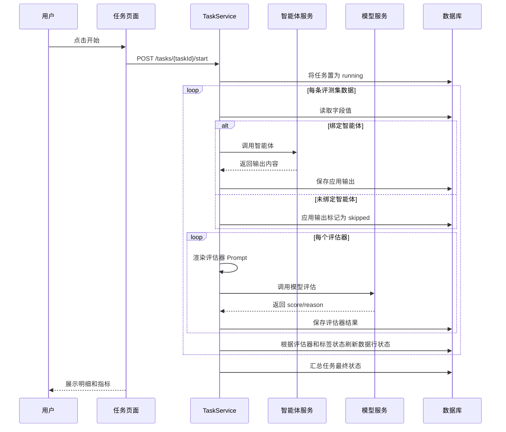

### 7.3 一条数据的执行例子

假设评测集有一条数据：

| 字段 | 值 |
| --- | --- |
| `query` | 什么是死锁？ |
| `reference_response` | 死锁是多个进程互相等待资源而无法继续执行的状态。 |

智能体返回：

```text
死锁是指两个或多个进程在执行过程中，因为争夺资源而互相等待，导致都无法继续向前推进。
```

评估器“问答相关性”配置：

```text
请判断回答是否正确回答用户问题。
问题：${query}
回答：${response}
参考答案：${reference_response}
请输出 JSON：{"score": 分数, "reason": "原因"}
```

系统会把参数替换成真实值，然后调用模型。模型返回：

```json
{
  "score": 5,
  "reason": "回答准确解释了死锁的核心含义，与参考答案一致。"
}
```

系统保存：

| 结果项 | 值 |
| --- | --- |
| 状态 | completed |
| 得分 | 5 |
| 通过结果 | PASS |
| 原因 | 回答准确解释了死锁的核心含义，与参考答案一致 |

### 7.4 重新开始任务

任务执行中可能失败或被中止。重新开始时，系统不应该无脑重跑所有数据，而应该根据当前状态判断哪些数据需要重新执行。

设计原则是：

- 已完成且有有效结果的数据不重复执行。
- 刚创建未执行的数据需要执行。
- 执行失败的数据需要重新执行。
- 人工标签的已标注内容应保留。

这样可以避免用户已经得到的应用输出和评估器结果被重复覆盖。

---

## 8. 远程调用与快照设计

评测任务会调用外部平台，包括智能体服务和模型服务。这里有两个设计重点：远程调用抽象和任务快照。

### 8.1 远程调用抽象

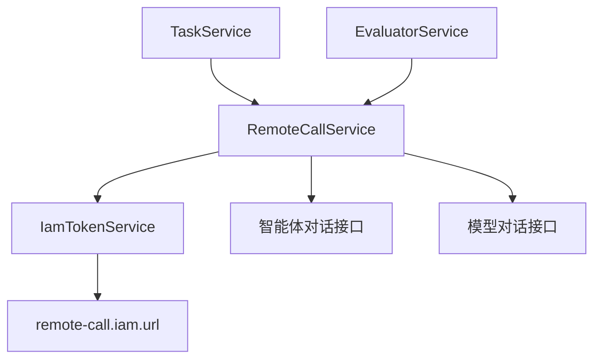

任务服务不直接拼 HTTP 请求，也不直接处理 token。它只调用 RemoteCallService。

这样做的好处是：

- 远程接口变更时，集中修改 RemoteCall 层。
- token 获取方式变更时，不影响任务业务逻辑。
- 智能体流式输出解析逻辑集中维护。
- 本地 mock、内外部环境适配更容易。

### 8.2 智能体输出结构

智能体返回内容可能不是单纯一段文本，而是多个内容块。当前系统会识别并整理这些字段：

| 字段 | 含义 |
| --- | --- |
| `text` | 用户最终看到的主要回答 |
| `reasoning` | 思考或推理内容 |
| `debug` | 调试信息 |
| `error` | 错误信息 |
| `rawText` | 多种内容拼接后的原始文本 |
| `skillTrigger` | 技能触发信息 |
| `references` | 引用信息 |
| `toolCall` | 工具调用信息 |
| `toolResponse` | 工具响应信息 |
| `genUi` | UI 卡片信息 |

当评估器参数选择“应用输出”时，可以选择这些字段之一。例如：

- 评估用户最终回答质量，通常选 `text`。
- 评估工具选择是否正确，可以选 `toolCall`。
- 评估引用来源是否合理，可以选 `references`。
- 兜底查看完整输出，可以选 `rawText`。

### 8.3 快照设计

任务创建时，系统会保存一些名称快照，例如：

- 智能体名称。
- 快照包版本名称。
- 子智能体标识。
- 评估器绑定模型名称。

为什么要保存名称快照？

假设任务列表要展示：

> 大学计算机专业老师 / V1 / 默认子智能体

如果不保存名称，列表每次渲染都要根据 ID 去远程查询智能体和快照包名称。这样会有几个问题：

- 页面先显示 ID，再变成名称，用户观感不好。
- 列表有很多任务时，请求次数增多。
- 远程服务异常时，历史任务展示也会受影响。
- 远程资源被改名或删除后，历史任务可能无法还原当时的展示。

因此任务创建时就把当时的名称保存下来。


快照的核心思想是：历史任务应该展示“当时创建任务时看到的信息”，而不是永远展示“当前远程资源的最新状态”。

---

## 9. 状态流转与异常处理

评测任务有多层状态：任务状态、任务数据行状态、智能体调用状态、评估器结果状态、标签结果状态。只有把这些状态分清楚，页面展示和重新执行逻辑才不会混乱。

### 9.1 任务状态

| 状态 | 含义 |
| --- | --- |
| `pending` | 已创建，待执行 |
| `running` | 执行中 |
| `completed` | 全部完成 |
| `failed` | 执行失败 |
| `stopped` | 用户中止 |

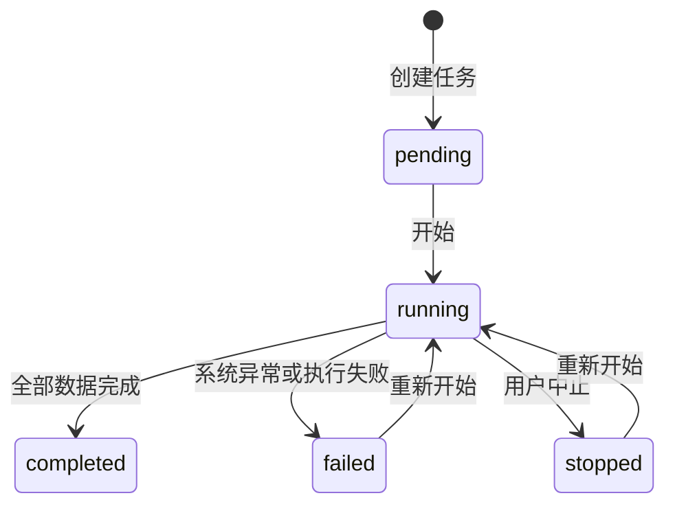

### 9.2 数据行状态

每条任务数据也有自己的状态。

| 状态 | 含义 |
| --- | --- |
| `pending` | 待执行 |
| `running` | 执行中 |
| `annotation_pending` | 自动部分完成，等待人工标注 |
| `completed` | 自动评估和人工标注都完成 |
| `failed` | 该条数据执行失败 |
| `stopped` | 该条数据被中止 |

一条数据是否完成，不只看智能体有没有回答，还要看它绑定的评估器和标签是否都完成。

### 9.3 评估器结果状态

| 状态 | 含义 |
| --- | --- |
| `pending` | 待评估 |
| `running` | 评估中 |
| `completed` | 评估完成 |
| `failed` | 评估失败 |
| `skipped` | 跳过 |
| `stopped` | 中止 |

### 9.4 标签结果状态

标签结果主要维护两类状态：

| 状态 | 含义 |
| --- | --- |
| `pending` | 待标注 |
| `completed` | 已标注 |

标签的核心是人工标注，因此不需要承载太多自动执行语义。任务中止不应该把已经标注的内容清掉，也不应该把标签值改成奇怪的执行状态。

### 9.5 异常处理思路

系统异常处理遵循两个原则：

1. 给用户友好的业务提示。
2. 避免把 SQL 或内部栈信息暴露到前端。

例如同一空间下创建同名资源时，不应该让数据库唯一约束错误直接透出，而应该在服务端提前校验并抛出友好提示：

> 当前空间下已存在同名评测集

这样用户知道怎么改，系统也不会暴露内部 SQL。

---

## 10. 数据展示与指标统计

任务详情是评测系统最重要的结果页。它既要让用户看到每条数据的细节，也要让用户快速判断整体质量。

### 10.1 数据明细

数据明细表格按列展示：

- 状态。
- 序号。
- 评测集字段。
- 应用输出。
- 每个评估器结果。
- 每个标签结果。
- 操作。

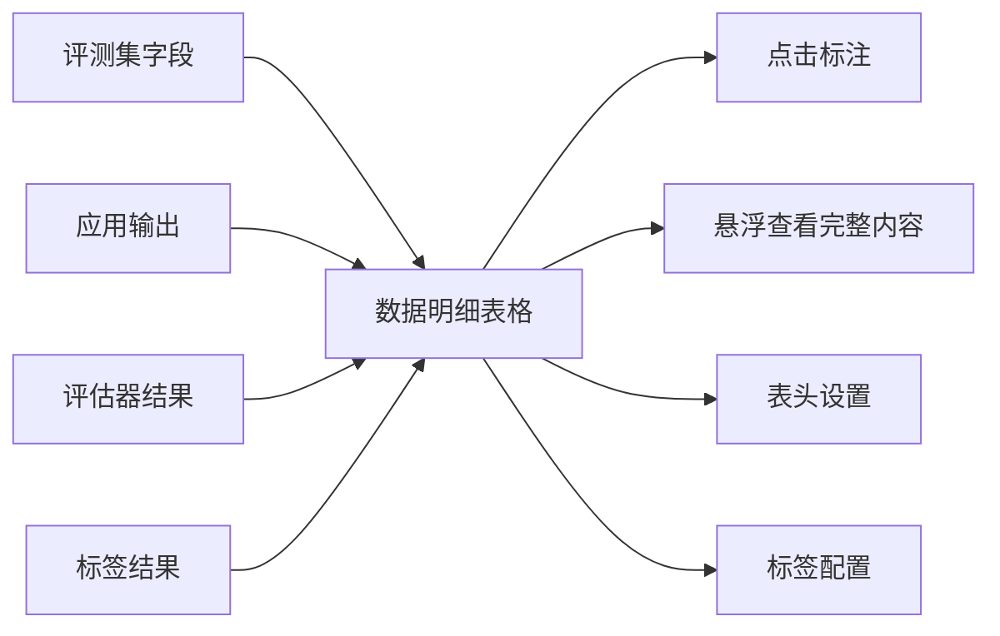

用户可以通过表头设置控制哪些列展示，也可以通过标签配置动态添加或移除任务标签。

### 10.2 标注页面

标注页面按三列布局：

1. 评测集数据。
2. 应用输出。
3. 标签和评估器。

这种布局的好处是：标注人可以同时看到“原始问题”“智能体回答”“需要标注的标签”，不用在多个页面之间来回跳。

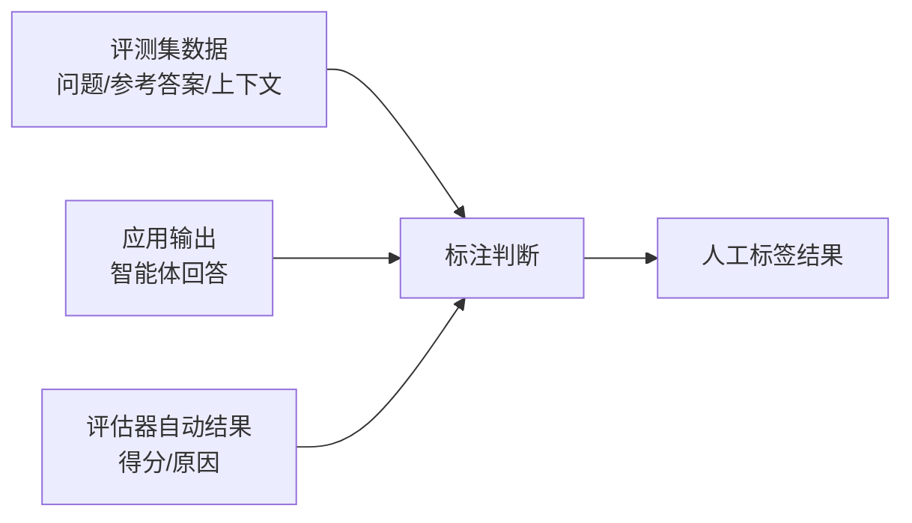

### 10.3 指标统计

指标统计页用于回答三个问题：

1. 整体表现怎么样？
2. 哪些维度表现好，哪些维度表现差？
3. 数据项通过、失败、未完成的分布如何？

当前指标统计拆成三个接口：

| 接口 | 用途 |
| --- | --- |
| `/tasks/{taskId}/metrics/overview` | 综合得分和评测进度 |
| `/tasks/{taskId}/metrics/score-summary` | 评估器和标签维度通过率 |
| `/tasks/{taskId}/metrics/item-distribution` | 数据项分布 |

这样拆分的好处是每个接口语义清晰，后续如果某块统计变复杂，也不会影响其他块。

### 10.4 综合得分计算

综合得分不是简单地对各个维度通过率取平均，而是按所有有效 PASS/FAIL 结果整体统计：

```text
综合得分 = PASS 总数 / (PASS 总数 + FAIL 总数)
```

注意：执行失败、未完成、跳过的数据不计入 PASS 或 FAIL，因此不会进入综合得分分母。

举例：

| 维度 | PASS | FAIL | 未完成 |
| --- | --- | --- | --- |
| 问答相关性 | 80 | 20 | 0 |
| 幻觉检测 | 70 | 10 | 20 |
| 人工标签 | 30 | 10 | 60 |

综合得分：

```text
(80 + 70 + 30) / (80 + 20 + 70 + 10 + 30 + 10)
= 180 / 220
= 81.8%
```

这比“每个维度通过率直接平均”更符合直觉，因为不同维度实际完成的数据量可能不同。

### 10.5 图表设计

指标统计页适合用多种图表组合：

| 图表 | 展示内容 |
| --- | --- |
| 仪表盘 | 综合得分 |
| 数字卡片 | 总量、已完成、未完成、进度 |
| 柱状图 | 各评估器/标签通过率 |
| 堆叠柱状图 | PASS、FAIL、未完成分布 |
| 环形图 | 单个维度的数据项分布 |

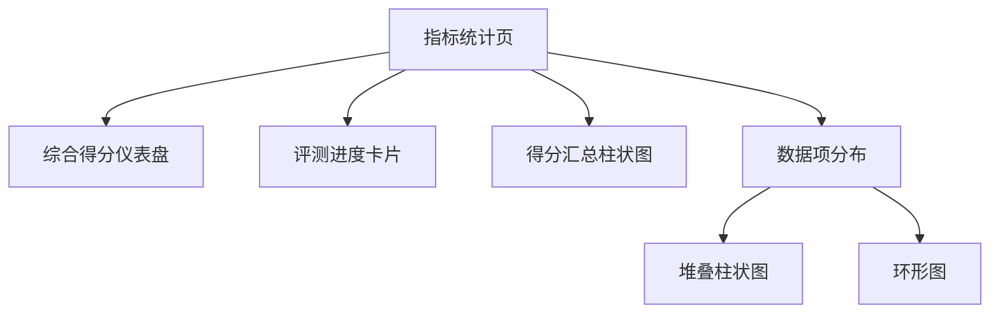

---

## 11. 前端交互设计

前端不仅是把数据展示出来，还要让用户在复杂流程里不迷路。评测系统涉及创建资源、发布版本、绑定字段、执行任务、查看结果、人工标注，如果交互不统一，用户会很难上手。

### 11.1 页面组织

当前主要页面包括：

| 页面 | 作用 |
| --- | --- |
| 评测集管理 | 管理评测集列表、创建评测集 |
| 评测集详情 | 管理版本、字段、数据、导入 Excel |
| 标签管理 | 管理标签列表、创建和编辑标签 |
| 评估器管理 | 管理自定义和预置评估器 |
| 评估器创建/详情 | 配置 Prompt、模型、参数、版本 |
| 评测任务管理 | 管理任务列表、开始/停止/复制/删除 |
| 评测任务创建 | 绑定评测集、应用、评估器、标签 |
| 评测任务详情 | 查看数据明细和指标统计 |
| 标注页面 | 对单条数据进行人工标注 |

### 11.2 通用组件设计

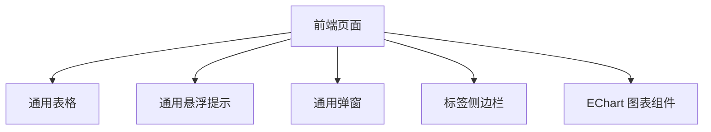

几个关键体验：

- 表格表头统一居中。
- 操作列统一居中。
- 超长单元格先省略，悬浮停留后再展示完整内容。
- 悬浮框统一白色风格，避免有的黑、有的白。
- 页面滚动条统一细一些。
- 创建页面采用中间内容区，减少大屏下表单过宽。
- 标签侧边栏在创建任务和任务详情中复用。

### 11.3 创建任务交互

创建任务本质上是一个分步骤配置流程：

```mermaid
flowchart TB
    A[基础信息] --> B[字段映射]
    B --> C[评估器]
    C --> D[标签]
    D --> E[完成创建]
```

对用户来说，最难理解的是“字段映射”。所以页面上需要把它设计成非常明确的“左边是什么参数，右边从哪里取值”。

例如评估器参数映射：

| 评估器参数 | 来源类型 | 具体字段 |
| --- | --- | --- |
| `query` | 评测集 | `query` |
| `response` | 应用输出 | `text` |
| `reference_response` | 评测集 | `reference_response` |

这样的表达比让用户直接填 JSON 更友好。

### 11.4 创建评估器交互

创建评估器页面分为左右两块：

- 左侧配置评估器。
- 右侧试运行。

```mermaid
flowchart LR
    A[左侧：配置] --> B[名称/描述]
    A --> C[创建方式]
    A --> D[模型和 Prompt]
    A --> E[参数配置]
    A --> F[评分范围]
    G[右侧：试运行] --> H[样例参数]
    G --> I[开始运行]
    G --> J[结果预览]
```

这样用户可以边写 Prompt 边试，不用来回切换页面。

---

## 12. 数据库与校验设计

数据库负责保存事实，服务端负责业务校验，前端负责提前提示。三者不是互相替代，而是分工协作。

### 12.1 数据库表分组

```mermaid
flowchart TB
    A[评测系统数据库] --> B[评测集相关表]
    A --> C[标签相关表]
    A --> D[评估器相关表]
    A --> E[任务相关表]

    B --> B1[t_eval_dataset]
    B --> B2[t_eval_dataset_version]
    B --> B3[t_eval_dataset_field]
    B --> B4[t_eval_dataset_item]
    B --> B5[t_eval_dataset_item_cell]

    C --> C1[t_eval_tag]
    C --> C2[t_eval_tag_option]

    D --> D1[t_eval_evaluator]
    D --> D2[t_eval_evaluator_version]
    D --> D3[t_eval_evaluator_param]

    E --> E1[t_eval_task]
    E --> E2[t_eval_task_item]
    E --> E3[t_eval_task_evaluator]
    E --> E4[t_eval_task_evaluator_result]
    E --> E5[t_eval_task_tag]
    E --> E6[t_eval_task_tag_result]
```

### 12.2 空间隔离

系统面向不同空间使用，所有核心表都有 `space_id` 字段。查询、创建、删除都应该基于当前空间进行隔离。

通俗理解：两个空间像两个班级，两个班级都可以有一个叫“期末测试”的评测集，但同一个班级里不应该出现两个同名“期末测试”。

### 12.3 名称重复校验

同一个空间下，资源名称不应该重复。涉及资源包括：

- 评测集名称。
- 标签名称。
- 自定义评估器名称。
- 评测任务名称。

当前设计倾向是：不要主要依赖数据库唯一约束来给用户报错，而是在前端和服务端都做校验。

| 层级 | 作用 |
| --- | --- |
| 前端 | 用户点击创建前先检查当前列表，尽早提示 |
| 服务端 | 插入数据库前再次查询，保证安全 |
| 数据库 | 尽量减少复杂业务约束，保留基础字段和索引 |

### 12.4 数值范围校验

系统中有一些数值输入，例如：

- 标签数字类型的最小值、最大值、通过阈值。
- 评估器评分范围最小值、最大值、通过阈值。

为了避免用户输入超大数字导致数据库或 Java 类型异常，前后端都限制范围：

```text
-100000 到 100000
```

这样用户体验更好，也能避免异常传到数据库层才暴露出来。

### 12.5 增量 SQL 管理

完整建表语句维护在：

- `DDL/01_eval_dataset.sql`
- `DDL/02_eval_tag.sql`
- `DDL/03_eval_evaluator.sql`
- `DDL/04_eval_task.sql`

后续版本变更维护在增量 SQL 中，例如：

- `DDL/increment_2608.sql`

这样做的好处是：

- 新环境可以直接执行完整建表。
- 已有环境可以按版本执行增量。
- 变更历史清晰，方便内外部环境同步。

---

## 13. 工程规范与质量保障

评测系统虽然是业务系统，但它和模型、智能体、任务执行、数据统计都有关系。如果没有工程规范，后续维护成本会很高。

### 13.1 代码规范

当前项目中逐步沉淀了一些规范：

| 规范 | 目的 |
| --- | --- |
| 前后端只使用 GET 和 POST | 适配公司内部接口规范 |
| `if` 语句必须使用大括号 | 避免低级分支错误 |
| `switch` 要有 `default` | 避免遗漏分支 |
| public/protected 元素加 Javadoc | 提升接口和仓储方法可读性 |
| 函数不要过长 | 降低维护成本 |
| 参数不要过多 | 避免方法职责过重 |
| 不提交无用测试代码和 0 用法方法 | 保持代码清爽 |
| 前端请求处不手动 try-catch | 公司框架统一处理异常 |

### 13.2 流水线门禁

流水线会检查：

- 圈复杂度。
- 超大函数。
- 重复代码。
- Javadoc。
- import 顺序。
- 未使用代码。
- 嵌套三元表达式等坏味道。

这些规则表面上看是“格式要求”，实际是为了防止系统在持续迭代后变成难以维护的代码。

### 13.3 测试策略

评测系统适合做几类测试：

| 测试类型 | 适合覆盖的内容 |
| --- | --- |
| 单元测试 | 字段类型校验、PASS/FAIL 计算、Prompt 参数替换 |
| 集成测试 | 创建任务、发布版本、导入 Excel |
| 冒烟测试 | 页面能打开、列表能加载、任务能创建 |
| 回归测试 | 修复过的 bug，例如 Excel 415、布尔值大小写、批量导入 |

测试代码可以写，但提交时要注意不要把临时、本地 mock、一次性调试代码推到远端。

### 13.4 日志设计

服务层方法适合在开始和结束时打印关键参数，例如：

```text
createTask start: taskName=xxx, datasetVersionId=xxx
createTask complete: taskId=xxx, itemCount=100
```

这样排查问题时可以快速知道：

- 用户传了什么。
- 系统创建了什么。
- 任务执行到了哪一步。
- 哪条数据失败了。

---

## 14. 可扩展性设计

系统当前已经覆盖评测集、标签、LLM 评估器、任务执行、人工标注和指标统计。后续还可以继续扩展。

### 14.1 Code 型评估器

当前 Code 型评估器暂未真正接入执行能力。未来可以支持用户编写函数，例如：

```python
def evaluate(query, response):
    if query in response:
        return {"score": 5, "reason": "回答包含关键内容"}
    return {"score": 1, "reason": "回答缺少关键内容"}
```

需要注意：

- 沙箱安全。
- 运行超时。
- 依赖管理。
- 执行日志。
- 输入输出协议。

### 14.2 评测报告导出

后续可以支持导出：

- PDF 报告。
- Excel 明细。
- 指标统计图。
- 失败样本列表。

这对团队汇报和版本对比很有价值。

### 14.3 多任务对比

如果同一个评测集分别评测了两个智能体版本，用户通常会想知道：

> V2 比 V1 好在哪里？差在哪里？

后续可以增加任务对比：

```mermaid
flowchart LR
    A[任务 A\n智能体 V1] --> C[对比分析]
    B[任务 B\n智能体 V2] --> C
    C --> D[整体通过率变化]
    C --> E[各评估器变化]
    C --> F[失败样本差异]
```

### 14.4 评估器模板市场

预置评估器可以继续扩展为模板市场：

- 安全性。
- 幻觉检测。
- 问答相关性。
- 格式遵循。
- 工具调用准确性。
- 知识引用准确性。

用户可以基于预置模板创建自己的评估器，然后微调 Prompt 和阈值。

### 14.5 数据闭环

评测系统未来还可以和智能体优化形成闭环：

```mermaid
flowchart TB
    A[评测任务] --> B[发现失败样本]
    B --> C[分析失败原因]
    C --> D[优化 Prompt/知识库/工具]
    D --> E[发布新智能体版本]
    E --> F[再次评测]
    F --> A
```

这样评测系统就不只是“看结果”，而是智能体持续优化的一部分。

---

## 15. 总结

智能体评测系统的核心价值，是把原本依赖人工经验的“智能体回答好不好”，变成一套可配置、可执行、可追踪、可统计的标准流程。

它通过评测集解决“用什么数据测”的问题，通过评估器解决“自动怎么判”的问题，通过标签解决“人工怎么补充判断”的问题，通过评测任务解决“如何把数据、应用和评估维度组织成一次可复现执行”的问题，通过指标统计解决“结果如何被理解”的问题。

从系统设计角度看，它有几个关键点：

- 使用版本机制保证历史任务可复现。
- 使用任务快照减少远程查询并稳定历史展示。
- 使用字段映射和参数映射支持灵活评测。
- 使用状态流转保证任务可中止、可恢复、可分析。
- 使用指标统计把明细结果转化为整体质量判断。
- 使用统一前端组件提升复杂系统的可用性。

如果把智能体平台比作“生产智能体的工厂”，那么评测系统就是“质量检测线”。只有检测线足够标准、稳定、可解释，智能体能力的迭代才真正有依据。

