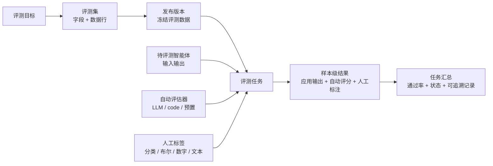
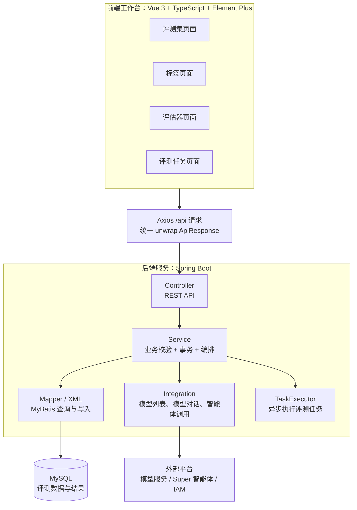
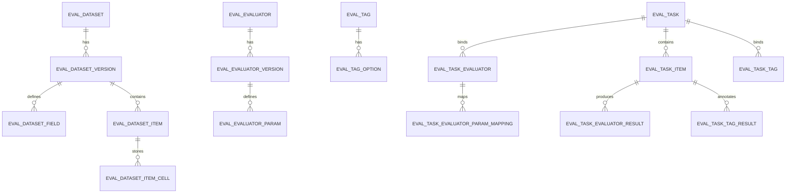
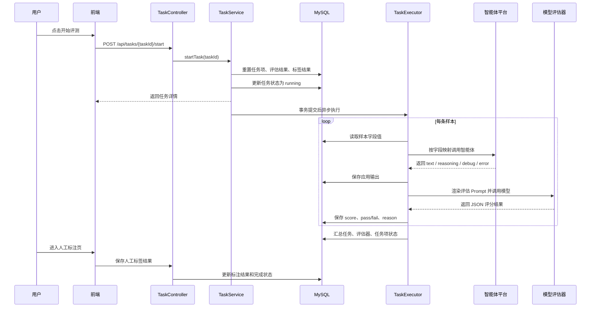
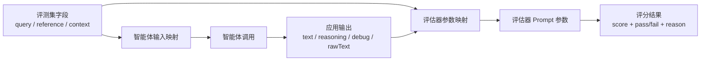

# Eval System 组会分享文档草稿

> 使用方式：前半部分是写作策略，帮助你把握分享重点；从“可复制正文”开始是可以直接填入组长文档的内容。Mermaid 图可以在 VS Code Markdown Preview、Typora、Obsidian 或 mermaid.live 中渲染成图片后粘贴到正式文档。

## 写作策略

### 推荐叙事

这次分享建议采用“评测闭环 + 工程实现 + 问题解决”的写法，而不是按菜单逐个介绍功能。

原因是这个项目的价值不在于“有几个页面”，而在于把智能体或大模型应用评测中原本零散的工作组织成一个可追踪流程：评测数据有版本，待测应用有输入输出映射，自动评估和人工标注能落到样本级结果，最后能形成任务级汇总。

### 三种写法对比

| 写法 | 优点 | 风险 | 建议 |
| --- | --- | --- | --- |
| 功能清单型 | 容易写，和系统页面对应 | 容易像产品说明书，工程亮点不明显 | 只在“实现”里作为模块说明使用 |
| 架构闭环型 | 能体现系统设计和模块关系 | 需要图和流程支撑 | 作为主线 |
| 问题驱动型 | 能体现解决问题的能力 | 如果没有案例会显得抽象 | 放在“核心问题如何解决”章节 |

推荐组合：定位章节讲“为什么需要评测闭环”，实现章节讲“怎么搭出这个闭环”，核心问题章节讲“哪些工程难点被解决了”，演示章节用一个案例把闭环跑通。

### 分享时的重点句

- 这个系统不是一次性评测脚本，而是面向智能体和大模型应用的评测任务管理平台。
- 核心目标是让评测过程可配置、可复用、可追踪。
- 评测集和评估器都有草稿和发布版本，任务只绑定发布版本，避免评测结果随着后续编辑发生漂移。
- 任务执行按样本落库，单条样本失败不会中断整批任务，便于复盘。
- 自动评估和人工标注不是互斥关系，系统把两者统一到任务结果视图里。

---

# 可复制正文

# 一、定位

## 1.1 项目背景

随着智能体和大模型应用逐步进入业务流程，团队需要回答一个越来越具体的问题：一个智能体到底好不好，不能只靠单次体验或主观判断，而需要有稳定的评测数据、明确的评估规则和可追溯的执行结果。

在实际开发中，智能体评测通常会遇到几个问题：

- 评测数据分散在 Excel、临时脚本或人工记录中，难以沉淀为可复用资产。
- 智能体输出和评估规则经常变化，如果没有版本管理，历史结果很难复现。
- 自动评估器、人工标签和应用输出之间缺少统一组织方式，评测结论容易割裂。
- 任务执行过程缺少样本级追踪，一旦出错难以定位是数据问题、应用问题还是评估器问题。

因此，本项目将评测数据、待评测应用、自动评估器和人工标签组织成“评测任务”，目标是形成一个面向智能体和大模型应用的评测系统 MVP。

## 1.2 一句话定位

Eval System 是一个面向智能体与大模型应用的评测任务管理系统，用于把评测集、智能体输出、自动评估器和人工标注组织成可配置、可运行、可追踪的评测闭环。

## 1.3 系统边界

当前版本聚焦在评测系统 MVP，不追求完整的模型训练、数据治理或 BI 分析平台能力，而是优先打通评测任务的核心闭环：

- 评测集管理：维护字段、数据行、Excel 导入、草稿和发布版本。
- 标签管理：维护人工标注维度，包括分类、布尔、数字和文本。
- 评估器管理：维护自定义 LLM/code 评估器、预置评估器和评估器版本。
- 评测任务：绑定评测集版本、智能体、评估器和标签，执行后保存样本级输出、评分和标注。
- 外部集成：对接模型列表、模型对话、智能体列表和 Super 智能体调用，也支持可选 IAM 模型通道。

## 1.4 评测闭环图

这张图建议作为“定位”章节的主图，帮助听众快速理解系统要解决的整体问题。

## 1.5 项目价值

这个系统的价值可以概括为三点。

第一，评测资产化。评测数据、评估器和标签都被沉淀为可维护的配置，而不是散落在临时文件里。

第二，评测过程可追踪。任务会绑定具体的评测集版本、评估器版本、智能体配置和样本结果，方便复盘历史结果。

第三，评测方式可组合。一个任务可以同时包含自动评估和人工标注，也可以选择是否关联智能体应用，从而适配不同阶段的评测需求。

# 二、实现

## 2.1 技术栈

系统采用前后端分离架构。

后端使用 Java 21、Spring Boot 3.3.5、Spring MVC、MyBatis Plus、MySQL、Apache POI 和 Maven，负责接口、业务校验、事务、任务编排、Excel 解析和外部平台集成。

前端使用 Vue 3.5、TypeScript、Vite 5、Vue Router、Element Plus 和 Axios，负责工作台式页面、表单配置、任务创建、结果展示和人工标注。

数据库使用 MySQL，DDL 按领域拆成评测集、标签、评估器和任务四组建表脚本。

## 2.2 总体架构

## 2.3 前端实现

前端采用“页面组件 + composable”的组织方式。页面组件主要负责展示结构，复杂状态、加载、校验和提交逻辑放到 `frontend/src/modules/*/composables/` 中。

当前主要页面包括：

| 模块 | 路由 | 主要能力 |
| --- | --- | --- |
| 评测集管理 | `/datasets`、`/datasets/:datasetId` | 创建评测集、维护字段、编辑数据行、Excel 导入、发布版本 |
| 标签管理 | `/tags` | 管理人工标注维度，支持分类、布尔、数字、文本 |
| 评估器管理 | `/evaluators`、`/evaluators/create`、`/evaluators/:evaluatorId` | 管理自定义评估器、提示词、参数、评分范围和发布版本 |
| 评测任务 | `/tasks`、`/tasks/create`、`/tasks/:taskId` | 创建任务、配置字段映射、启动任务、查看样本级结果 |
| 人工标注 | `/tasks/:taskId/items/:taskItemId/annotation` | 对任务样本进行人工标注，支持上一条/下一条切换 |

前端 API 封装统一放在 `frontend/src/api/*.ts` 中，各模块都通过 `axios.create({ baseURL: "/api" })` 访问后端，并使用 `unwrap` 处理统一响应格式。

## 2.4 后端实现

后端按领域模块拆分，整体结构比较稳定：

| 模块 | 职责 |
| --- | --- |
| `common` | 统一响应、分页结构、全局异常处理 |
| `dataset` | 评测集、版本、字段、行、Excel 导入 |
| `tag` | 人工标签和标签选项 |
| `evaluator` | 自定义评估器、预置评估器、评估器版本和参数 |
| `task` | 评测任务创建、执行、结果保存、人工标注 |
| `integration` | 外部模型、智能体平台、IAM 通道对接 |

接口返回统一使用 `ApiResponse<T>`。成功时 `code = 0`，业务参数错误通过 `IllegalArgumentException` 映射为 HTTP 400，未处理异常映射为 HTTP 500。

后端在任务执行上采用异步方式：用户点击开始任务后，接口先完成状态初始化和数据库提交，再通过 `TaskExecutor` 执行耗时评测流程，避免长时间阻塞 HTTP 请求。

## 2.5 领域模型

系统的数据模型围绕“配置资产”和“执行结果”展开。评测集、标签、评估器属于配置资产；评测任务、任务项、评估结果、标注结果属于执行结果。

## 2.6 任务执行流程

# 三、核心问题如何解决

## 3.1 如何保证评测结果可复现

问题：如果评测数据或评估器随时可以被修改，那么一次历史评测结果很难解释清楚。当有人追问“这次评分基于哪批数据、哪版规则”时，如果没有版本机制，就只能依赖人工记忆。

解决方案：系统为评测集和评估器都设计了草稿版本和发布版本。草稿版本用于编辑，发布版本用于绑定任务。任务创建时只能选择已发布的评测集版本，自定义评估器也通过版本绑定。

这样做的好处是，任务一旦创建，就能固定当时使用的数据结构、样本内容和评估规则。后续即使继续编辑草稿，也不会影响已执行任务的历史结果。

## 3.2 如何让数据集、智能体和评估器灵活组合

问题：不同评测集字段不一样，不同智能体输入输出也不一样，评估器需要的参数也不一样。如果每种组合都写死逻辑，系统会很快失去扩展性。

解决方案：系统引入字段映射机制，把三类对象解耦：

- 应用字段映射：把评测集字段映射到智能体输入字段。
- 评估器参数映射：把评估器参数映射到评测集字段或应用输出。
- 应用输出抽象：把智能体返回内容统一整理为 `text`、`reasoning`、`debug`、`error`、`rawText` 等可引用字段。

因此，同一个评测集可以评测不同智能体，同一个评估器也可以复用到不同数据集，只需要重新配置映射关系。

## 3.3 如何处理任务执行中的失败

问题：评测任务通常包含多条样本、多种评估器和可选的智能体调用。任何一个外部接口失败都可能导致任务中断，如果没有细粒度状态，后续很难定位问题。

解决方案：系统把任务拆成任务级、评估器级、样本级和结果级状态：

- 任务状态：`pending`、`running`、`completed`、`failed`。
- 任务项状态：`pending`、`running`、`annotation_pending`、`completed`、`failed`。
- 应用输出状态：`pending`、`running`、`completed`、`failed`、`skipped`。
- 评估结果状态：`pending`、`running`、`completed`、`failed`、`skipped`。

执行时，单条样本调用失败会记录到该样本和对应评估结果，不会直接让整个循环失控。任务重跑时会先清理旧的应用输出、评估结果和标签状态，再重新进入执行流程。

## 3.4 如何把外部模型和智能体平台接入系统

问题：外部平台往往有认证、Cookie 过期、SSE 流式输出、不同返回结构等细节。如果这些逻辑散落在业务代码里，会影响任务执行的稳定性。

解决方案：系统将外部平台能力集中到 `integration` 模块：

- 模型列表接口：获取可选评估模型。
- 模型对话接口：供 LLM 评估器调用。
- 智能体列表接口：获取可评测智能体。
- Super 智能体调用：支持消息数组请求、SSE 响应解析和输出聚合。
- IAM 通道：可选启用 IAM 模型调用，并对模型列表进行过滤。
- 登录和重试：Cookie 被拒绝时自动重新登录并重试。

这样任务模块只关心“我要调用模型”或“我要调用智能体”，不需要直接处理底层 HTTP 和认证细节。

## 3.5 如何让自动评估和人工标注并存

问题：大模型应用评测不能完全依赖自动评分。有些维度适合模型评分，例如回答一致性、相关性、完整性；有些维度仍需要人工判断，例如业务可接受性、风险等级、错误类型。

解决方案：系统在任务中同时绑定评估器和标签。评估器结果进入 `eval_task_evaluator_result`，人工标注进入 `eval_task_tag_result`。任务详情页同时展示自动评分和人工标注结果，人工标注页可以按样本逐条处理。

这种设计让系统既能提升评测效率，又保留人工校验入口，适合 MVP 阶段逐步积累评测标准。

## 3.6 当前取舍

当前版本有意保留了一些边界：

- code 评估器已有配置入口，但任务执行中尚未接入真实代码执行接口。
- 当前重点是打通评测闭环，暂未做复杂统计报表和权限体系。
- 任务执行采用本地 `TaskExecutor`，适合 MVP 和小规模评测；后续如果任务量变大，可以演进为队列或分布式执行。

这些取舍使当前版本能优先验证核心业务流程，同时为后续扩展留下接口。

# 四、演示与案例

## 4.1 演示目标

演示部分建议不要按“我点了哪些页面”来讲，而是用一个具体案例串起来，让听众看到系统如何完成一次真实评测。

建议案例：知识库问答智能体评测。

案例目标：评测一个问答智能体在企业知识库问题上的回答质量。系统需要批量输入问题，调用智能体得到回答，再通过自动评估器判断回答是否与参考答案一致，并由人工补充风险标签和备注。

## 4.2 示例评测集

可以准备一个小型评测集，字段设计如下：

| 字段名 | 类型 | 是否必填 | 说明 |
| --- | --- | --- | --- |
| `query` | string | 是 | 用户问题 |
| `reference_response` | string | 是 | 参考答案 |
| `expected_keywords` | string | 否 | 期望命中的关键点 |
| `scenario` | string | 否 | 问题场景，例如售后、合同、流程咨询 |

示例数据：

| query | reference_response | expected_keywords | scenario |
| --- | --- | --- | --- |
| 报销流程需要哪些材料？ | 需要发票、审批单、付款证明，并在系统中提交报销申请。 | 发票、审批单、系统提交 | 流程咨询 |
| 合同审批一般需要多久？ | 普通合同通常 3 个工作日内完成，复杂合同需法务复核。 | 3 个工作日、法务复核 | 合同 |

## 4.3 推荐演示路径

### 第一步：维护评测集

演示内容：

- 创建评测集。
- 配置字段。
- 通过 Excel 导入数据。
- 发布评测集版本。

讲解重点：

这里强调“草稿用于编辑，发布版本用于评测”。发布动作的意义是冻结一次稳定的数据口径，保证任务结果可复现。

截图位：

- 评测集列表页。
- 评测集详情页的字段和数据行。
- 发布版本后的版本列表。

### 第二步：维护评估规则

演示内容：

- 展示预置评估器。
- 展示自定义 LLM 评估器的提示词、参数、评分范围和通过阈值。
- 如果时间允许，可以展示评估器发布版本。

讲解重点：

评估器不是直接写死在任务里的，而是被抽象成可复用配置。LLM 评估器通过参数映射拿到输入，再要求模型输出包含 `score` 和 `reason` 的 JSON 结果。

截图位：

- 评估器列表。
- 评估器编辑页。
- 预置评估器选择区域。

### 第三步：创建评测任务

演示内容：

- 选择已发布评测集版本。
- 选择是否关联智能体。
- 配置智能体输入字段映射。
- 添加自动评估器，并把评估器参数映射到评测集字段或应用输出。
- 添加人工标签。

讲解重点：

这是整个系统最核心的一步。任务创建不是简单选择几个对象，而是把数据、应用、自动规则和人工规则组合成一次可执行评测。

截图位：

- 创建任务基础信息区域。
- 智能体字段映射区域。
- 评估器参数映射区域。
- 已选标签区域。

### 第四步：启动任务并查看结果

演示内容：

- 从任务列表或详情页启动任务。
- 进入任务详情页查看任务状态。
- 查看样本级应用输出、评估器得分、通过结果和错误信息。

讲解重点：

任务执行是异步的。开始任务后，后端先更新状态，再在事务提交后异步执行。每条样本都会保存应用输出和评估结果，因此任务结束后可以定位到具体样本。

截图位：

- 任务列表状态变化。
- 任务详情页的评估器维度。
- 样本结果表格。
- 某条样本的应用输出和自动评分。

### 第五步：人工标注

演示内容：

- 打开某条任务样本的人工标注页。
- 对分类、布尔、数字或文本标签进行标注。
- 保存后返回任务详情查看状态更新。

讲解重点：

人工标注用于补足自动评估难以覆盖的业务判断。系统把人工标注结果和自动评估结果放在同一条样本结果中，后续可以对比模型评分和人工判断。

截图位：

- 人工标注页。
- 标注后的任务详情页。

## 4.4 演示讲稿示例

可以按下面这段节奏录视频或现场讲：

> 我这次演示的是一次知识库问答智能体的评测。首先我在系统里维护一份评测集，包括用户问题、参考答案和期望关键词。评测集可以先作为草稿编辑，确认后发布成版本，后续任务只能绑定发布版本，这样可以保证评测结果不会受到后续数据编辑影响。
>
> 接下来我配置评估规则。系统支持预置评估器和自定义评估器。以 LLM 评估器为例，它会通过参数映射拿到用户问题、参考答案和智能体回答，再调用模型输出结构化评分。
>
> 然后我创建评测任务。这里选择刚才发布的评测集版本，关联一个待测智能体，把评测集里的 query 字段映射到智能体输入，再把智能体输出映射给评估器参数。同时我也添加人工标签，用来记录自动评分之外的业务判断。
>
> 点击开始后，任务会异步执行。系统逐条样本调用智能体，保存应用输出，再调用评估器生成评分和原因。任务详情页可以看到每条样本的状态、应用输出、自动评分和人工标签结果。如果某条样本失败，错误也会落到样本级结果中，方便定位问题。

## 4.5 文档配图清单

正式文档建议至少放 5 类图：

| 图 | 放置章节 | 获取方式 |
| --- | --- | --- |
| 评测闭环图 | 定位 | 使用本文 Mermaid 渲染 |
| 总体架构图 | 实现 | 使用本文 Mermaid 渲染 |
| 领域模型图 | 实现 | 使用本文 Mermaid 渲染 |
| 任务执行流程图 | 实现或核心问题 | 使用本文 Mermaid 渲染 |
| 系统截图 | 演示与案例 | 从本地系统页面截图 |

截图建议至少包含：

- 评测集详情页：体现字段、数据行、版本发布。
- 任务创建页：体现字段映射、评估器配置、标签选择。
- 任务详情页：体现样本级输出、评分、状态。
- 人工标注页：体现自动评估和人工判断的结合。

## 4.6 总结

Eval System 当前已经打通了评测系统 MVP 的主流程：评测集版本化、评估器配置化、任务异步执行、样本级结果落库、自动评估和人工标注结合。

从工程实现上看，项目的重点不是单个页面，而是围绕评测任务建立了一套可扩展的数据模型和执行链路。后续可以在这个基础上继续扩展代码评估器真实执行、评测报告统计、权限管理和更大规模的任务调度。
