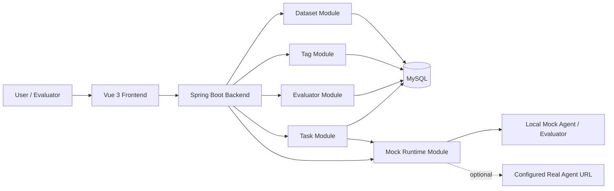

# Eval System


一个面向智能体与应用输出质量评测的前后端分离系统。它把评测集、标签、评估器、评测任务和 Mock 运行时串成一条可执行链路，用于在真实智能体/评估 LLM 完整接入前，先跑通评测数据管理、自动评分、任务结果落库和人工标注闭环。

> 当前重点：用内置 Mock 模块模拟智能体与评估器执行。配置真实超级智能体 URL 后，Mock 模块也可以作为转发层接收 SSE/JSON/文本响应并聚合为任务输出。

## Table of Contents

- [Why Eval System](#why-eval-system)
- [Features](#features)
- [Architecture](#architecture)
- [Modules](#modules)
- [Tech Stack](#tech-stack)
- [Getting Started](#getting-started)
- [Mock Runtime](#mock-runtime)
- [Typical Workflow](#typical-workflow)
- [Documentation](#documentation)
- [API Overview](#api-overview)
- [Project Structure](#project-structure)
- [Development](#development)
- [Configuration](#configuration)
- [Current Boundaries](#current-boundaries)
- [Roadmap](#roadmap)
- [Contributing](#contributing)
- [License](#license)
- [README References](#readme-references)

## Why Eval System

智能体评测通常不只是“给一批问题打分”。一个可落地的评测平台至少需要管理评测数据版本、应用输入映射、自动评估器、人工标签、任务执行状态和行级结果。Eval System 当前解决的是这条链路的基础工程问题：

- 让评测集有草稿和发布版本，任务只绑定稳定版本。
- 让评估器以 LLM/Code 两类形态配置，并通过参数映射接入评测集字段或应用输出。
- 让智能体调用先通过 Mock 模块完成联调，避免真实模型和外部服务未就绪时阻塞主流程。
- 让任务结果以行级粒度保存，支持后续失败重试、调用日志、成本统计和真实 Provider 接入。

## Features

- **评测集管理**：创建评测集，维护字段，单条新增、批量导入或全量覆盖数据，发布版本，使用历史版本覆盖草稿。
- **标签管理**：支持分类、布尔、数字、文本标签；分类/布尔选项可绑定 `pass` / `fail`。
- **评估器管理**：支持预置评估器查看，自定义 LLM 评估器，自定义 Code 评估器，草稿编辑、复制和版本发布。
- **评测任务**：绑定已发布评测集版本、智能体应用、评估器和人工标签；支持任务启动、终止、删除和详情查看。
- **字段映射**：智能体输入映射到评测集字段；评估器参数可映射到评测集字段或智能体输出字段。
- **Mock 运行时**：提供 Mock 智能体和 Mock 评估器接口，支持稳定评分、强制输出、失败、超时和真实智能体转发。
- **人工标注**：在任务详情中查看行级数据和自动评分结果，并进入标注页完成标签结果。
- **统一响应结构**：接口统一返回 `code`、`msg`、`data`。

## Architecture



任务执行主链路：

```text
评测集发布版本
  -> 创建评测任务
  -> 可选调用 Mock/真实智能体生成 app_output
  -> 调用 Mock 评估器生成 score/reason
  -> 写入任务行结果和评估器结果
  -> 人工标签标注
  -> 任务状态收敛为 completed / failed / running
```

## Modules

| Module | Frontend Route | Backend API | Description |
| --- | --- | --- | --- |
| 评测集 | `/datasets` | `/api/datasets` | 评测数据、字段结构、草稿/发布版本、Excel 导入。 |
| 标签 | `/tags` | `/api/tags` | 人工标注维度，支持分类、布尔、数字、文本。 |
| 评估器 | `/evaluators` | `/api/evaluators` | 预置/自定义评估器，LLM/Code 配置，版本发布。 |
| 评测任务 | `/tasks` | `/api/tasks` | 任务创建、启动、终止、结果明细、人工标注。 |
| Mock 运行时 | 任务创建页内使用 | `/api/mock` | Mock 智能体、Mock 评估器、真实智能体转发适配。 |

## Tech Stack

| Layer | Stack |
| --- | --- |
| Frontend | Vue 3, TypeScript, Vite, Vue Router, Element Plus, Axios |
| Backend | Java 21, Spring Boot 3.3.5, MyBatis-Plus, Apache POI |
| Database | MySQL |
| Build | Maven, npm |

## Getting Started

### Prerequisites

- JDK 21
- Maven 3.8+
- Node.js 18+ 与 npm
- MySQL 8.x

### 1. Clone

```bash
git clone <repo-url>
cd eval_system
```

### 2. Initialize Database

创建数据库：

```sql
CREATE DATABASE IF NOT EXISTS eval_system
  DEFAULT CHARACTER SET utf8mb4
  COLLATE utf8mb4_unicode_ci;
```

按顺序执行建表脚本：

```bash
mysql -u root -p eval_system < DDL/01_eval_dataset.sql
mysql -u root -p eval_system < DDL/02_eval_tag.sql
mysql -u root -p eval_system < DDL/03_eval_evaluator.sql
mysql -u root -p eval_system < DDL/04_eval_task.sql
```

### 3. Configure Backend

默认配置位于 `backend/src/main/resources/application.yml`：

```yaml
server:
  port: 8080

spring:
  datasource:
    url: jdbc:mysql://localhost:3306/eval_system?createDatabaseIfNotExist=true&useUnicode=true&characterEncoding=utf8&serverTimezone=Asia/Shanghai&useSSL=false&allowPublicKeyRetrieval=true
    username: root
    password: 123456

mock:
  agent:
    url:
    connect-timeout-ms: 5000
    read-timeout-ms: 60000
```

如果本地 MySQL 账号、密码或端口不同，先修改该文件。

### 4. Start Backend

```bash
cd backend
mvn spring-boot:run
```

后端默认地址：

```text
http://localhost:8080
```

### 5. Start Frontend

```bash
cd frontend
npm install
npm run dev
```

前端默认地址：

```text
http://localhost:5173
```

Vite 已将 `/api` 代理到 `http://localhost:8080`。

### 6. Smoke Test

后端启动后，可先检查 Mock 智能体列表：

```bash
curl http://localhost:8080/api/mock/agents
```

如果返回 `code: 0`，说明后端、统一响应和 Mock 模块已经可用。

## Mock Runtime

Mock 模块位于当前后端服务内，不需要单独启动进程。它用于在真实智能体、评估 LLM 和 Code 执行器未完整接入前，模拟任务执行闭环。

### Endpoints

| Endpoint | Purpose |
| --- | --- |
| `GET /api/mock/agents` | 返回任务创建页可选的 Mock 智能体定义、版本、输入和输出字段。 |
| `POST /api/mock/agent/chat` | 模拟智能体对话；配置 `mock.agent.url` 后转发到真实智能体。 |
| `POST /api/mock/evaluators/evaluate` | 模拟 LLM/Code 评估器评分，返回 `score`、`reason`、`status`。 |

### Agent Output

Mock 智能体输出会聚合为：

| Output Key | Description |
| --- | --- |
| `text` | 主要回答内容，默认也映射为 `answer` / `content`。 |
| `reasoning` | 模拟或转发聚合后的思考过程。 |
| `debug` | 调试信息。 |
| `error` | 错误信息；出现时该行智能体调用标记为失败。 |
| `rawText` | 合并后的原始文本。 |

### Control Tokens

在评测集字段、Prompt 或参数中加入以下指令，可模拟边界场景：

| Token | Effect |
| --- | --- |
| `[mock:agent_fail]` | 智能体调用失败。 |
| `[mock:evaluator_fail]` | 评估器调用失败。 |
| `[mock:timeout]` | 模拟超时失败。 |
| `[mock:score=88]` | 强制评估器返回指定分数，并按评分范围裁剪。 |
| `[mock:agent_output=指定输出]` | 强制智能体返回指定 `text`。 |
| `[mock:debug=指定调试信息]` | 强制智能体返回指定 `debug`。 |
| `[mock:reasoning=指定思考过程]` | 强制智能体返回指定 `reasoning`。 |
| `[mock:error=指定错误信息]` | 强制智能体返回指定 `error`，并标记失败。 |

更多协议细节见 [MOCK服务接口.md](MOCK服务接口.md)。

## Typical Workflow

1. 在“评测集管理”创建评测集，维护字段并录入数据。
2. 发布评测集草稿版本；评测任务只能绑定发布版本。
3. 在“标签管理”创建人工标签，例如质量分类、是否通过、人工分数、备注文本。
4. 在“评估器管理”创建自定义 LLM/Code 评估器，或基于预置评估器创建自定义版本。
5. 在“评测任务”创建任务：
   - 选择已发布评测集版本。
   - 选择“不关联应用”或“智能体”。
   - 如选择智能体，将智能体输入映射到评测集字段。
   - 添加评估器，并将评估器参数映射到评测集字段或应用输出。
   - 添加人工标签。
6. 启动任务，系统逐行调用 Mock 智能体与 Mock 评估器并写入结果。
7. 在任务详情页查看应用输出、自动评分、Pass/Fail、失败原因。
8. 进入标注页完成行级人工标签。

## Documentation

| Document | Description |
| --- | --- |
| [接口文档.md](接口文档.md) | 主业务接口文档。 |
| [MOCK服务接口.md](MOCK服务接口.md) | Mock 智能体、Mock 评估器、真实智能体转发协议。 |
| [使用文档/评测集.md](使用文档/评测集.md) | 评测集功能说明和产品参考。 |
| [使用文档/标签管理.md](使用文档/标签管理.md) | 标签类型、标注方式和使用场景。 |
| [使用文档/评估器.md](使用文档/评估器.md) | 预置/自定义评估器、LLM/Code 评估器说明。 |
| [使用文档/评测任务.md](使用文档/评测任务.md) | 评测任务创建、管理和标注流程。 |
| [阿里云百炼平台评测系统示例图片](阿里云百炼平台评测系统示例图片) | 产品参考截图。 |

## API Overview

统一响应结构：

```json
{
  "code": 0,
  "msg": "success",
  "data": {}
}
```

主要接口：

| Resource | Endpoint |
| --- | --- |
| Datasets | `GET /api/datasets`, `POST /api/datasets` |
| Dataset Versions | `GET /api/datasets/{datasetId}/versions`, `POST /api/datasets/{datasetId}/publish` |
| Dataset Rows | `POST /api/datasets/versions/{versionId}/items`, `POST /api/datasets/versions/{versionId}/items/import` |
| Tags | `GET /api/tags`, `POST /api/tags`, `PUT /api/tags/{tagId}` |
| Evaluators | `GET /api/evaluators`, `POST /api/evaluators`, `POST /api/evaluators/{evaluatorId}/publish` |
| Preset Evaluators | `GET /api/evaluators/presets/categories`, `GET /api/evaluators/presets` |
| Tasks | `GET /api/tasks`, `POST /api/tasks`, `POST /api/tasks/{taskId}/start` |
| Annotation | `GET /api/tasks/{taskId}/items/{taskItemId}/annotation`, `PUT /api/tasks/{taskId}/items/{taskItemId}/annotation` |
| Mock | `GET /api/mock/agents`, `POST /api/mock/agent/chat`, `POST /api/mock/evaluators/evaluate` |

## Project Structure

```text
eval_system
|-- backend
|   |-- src/main/java/com/evalsystem
|   |   |-- common       # ApiResponse, PageResponse, global exception handler
|   |   |-- config       # Web/CORS config
|   |   |-- dataset      # 评测集、版本、字段、数据行
|   |   |-- tag          # 人工标签和标签选项
|   |   |-- evaluator    # 预置/自定义评估器
|   |   |-- task         # 评测任务、执行、标注
|   |   `-- mock         # Mock 智能体和 Mock 评估器运行时
|   `-- src/main/resources
|       |-- application.yml
|       `-- mapper
|-- frontend
|   |-- src/api          # Axios API clients
|   |-- src/config       # 模块元信息
|   |-- src/layouts      # 页面布局
|   |-- src/modules      # 业务 composables
|   |-- src/router       # Vue Router
|   |-- src/views        # 页面组件
|   `-- src/types.ts
|-- DDL                  # MySQL table creation scripts
|-- 使用文档              # 产品使用文档
|-- 阿里云百炼平台评测系统示例图片
|-- MOCK服务接口.md
|-- 接口文档.md
`-- README.md
```

## Development

后端：

```bash
cd backend
mvn spring-boot:run
mvn test
mvn package
```

前端：

```bash
cd frontend
npm install
npm run dev
npm run build
npm run preview
```

本地端口：

| Service | URL |
| --- | --- |
| Frontend Dev Server | `http://localhost:5173` |
| Backend API | `http://localhost:8080` |
| Vite Proxy | `/api -> http://localhost:8080` |

## Configuration

### Database

```yaml
spring:
  datasource:
    url: jdbc:mysql://localhost:3306/eval_system?createDatabaseIfNotExist=true&useUnicode=true&characterEncoding=utf8&serverTimezone=Asia/Shanghai&useSSL=false&allowPublicKeyRetrieval=true
    username: root
    password: 123456
```

### Upload Limits

```yaml
spring:
  servlet:
    multipart:
      max-file-size: 20MB
      max-request-size: 20MB
```

### Mock Agent Forwarding

```yaml
mock:
  agent:
    # 留空：使用本地 Mock 响应
    # 填写 URL：转发到真实超级智能体，并聚合 SSE / JSON / 文本响应
    url:
    connect-timeout-ms: 5000
    read-timeout-ms: 60000
```

## Current Boundaries

- 仓库当前包含预置评估器表结构和查询接口，但没有 seed 数据脚本；如果要在页面显示预置评估器，需要补充 `eval_preset_evaluator_category`、`eval_preset_evaluator`、`eval_evaluator_param` 初始化数据。
- LLM 评估器和 Code 评估器当前通过 Mock 运行时产生稳定模拟分数；尚未接入真实评估 LLM 或 Python 代码执行沙箱。
- 智能体应用当前使用内置 Mock 定义；配置 `mock.agent.url` 后可转发真实超级智能体接口，但还没有独立的智能体管理模块。
- `app_output` 当前以 JSON 字符串形式保存聚合后的 `debug/reasoning/text/error/rawText`。
- 仓库没有 `LICENSE`、`CONTRIBUTING.md`、`CHANGELOG.md` 等开源项目治理文件。
- `.gitignore` 忽略 `frontend/package-lock.json`，因此前端依赖安装版本可能随 npm 解析而变化；需要可重复构建时建议提交锁文件。

## Roadmap

- [ ] 增加预置评估器初始化脚本。
- [ ] 抽象真实 `AgentProvider` 与 `EvaluatorProvider`，让 Mock/真实调用共用执行协议。
- [ ] 接入真实 LLM 评估服务。
- [ ] 接入 Code 评估沙箱。
- [ ] 增加任务异步执行、并发控制、失败重试和调用日志。
- [ ] 增加模型管理、智能体管理和 Provider 配置页面。
- [ ] 增加自动化测试和 CI。
- [ ] 补充许可证、贡献指南和变更日志。

## Contributing

当前仓库还没有正式贡献指南。建议提交变更前至少完成：

1. 确认数据库脚本、后端 DTO、前端类型和接口文档同步。
2. 后端改动运行 `mvn test` 或至少 `mvn package`。
3. 前端改动运行 `npm run build`。
4. 涉及评测任务执行链路时，使用 Mock 控制指令覆盖成功、失败、超时和强制分数场景。

## License

当前仓库尚未包含 `LICENSE` 文件。正式对外发布或允许外部使用、复制、修改、分发前，请先补充许可证。

## README References

本 README 的结构参考了以下项目和文档的常见组织方式：顶部定位和徽章、快速开始、文档入口、贡献说明、许可证和项目边界说明。

- [GitHub Docs: About READMEs](https://docs.github.com/en/repositories/managing-your-repositorys-settings-and-features/customizing-your-repository/about-readmes)
- [React](https://github.com/react/react)
- [Kubernetes](https://github.com/kubernetes/kubernetes)
- [Visual Studio Code](https://github.com/microsoft/vscode)
- [Awesome README](https://github.com/matiassingers/awesome-readme)
