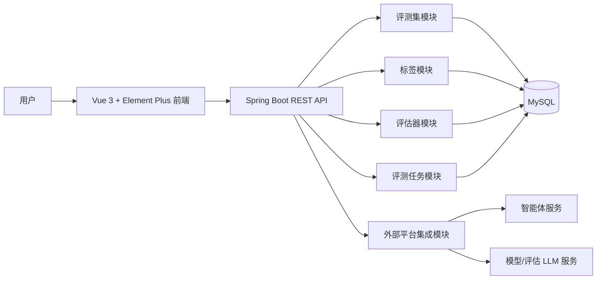
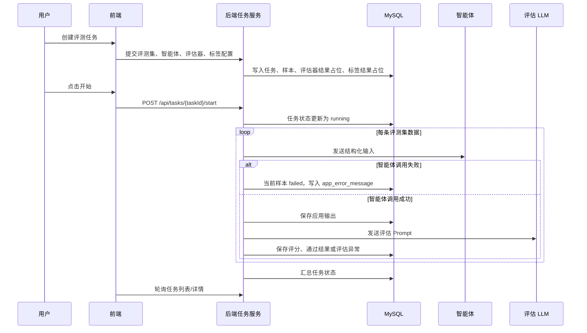

# Eval System

一个面向智能体与大模型应用的评测系统最小可运行版本。项目提供评测集管理、标签管理、评估器管理、评测任务编排、任务执行与人工标注能力，适合作为后续接入真实智能体、评估 LLM、Mock 服务和评测流水线的基础工程。


## 目录

- [项目简介](#项目简介)
- [核心能力](#核心能力)
- [系统架构](#系统架构)
- [评测任务流程](#评测任务流程)
- [技术栈](#技术栈)
- [快速开始](#快速开始)
- [配置说明](#配置说明)
- [目录结构](#目录结构)
- [主要模块](#主要模块)
- [接口概览](#接口概览)
- [开发命令](#开发命令)
- [当前边界](#当前边界)
- [README 结构参考](#readme-结构参考)

## 项目简介

Eval System 用来把“评测集中的一行数据”组织成一次可追踪的评测执行：系统读取评测集字段，按配置调用待评测智能体，保存应用输出，再按评估器参数映射构造评估 Prompt，调用评估 LLM 并保存评分结果。对于需要人工判断的维度，系统支持标签绑定和逐条标注。

当前版本已经具备最小闭环：

- 创建、编辑、发布评测集版本，并维护字段和数据行。
- 创建标签，支持分类、布尔、数字、文本等标注类型。
- 创建自定义评估器版本，管理预置评估器。
- 创建评测任务，绑定评测集版本、智能体、评估器和标签。
- 启动评测任务，按样本逐条执行并实时落库。
- 查看任务列表、任务详情、单条数据评测结果和标注页面。

## 核心能力

### 评测集管理

- 字段配置：支持 string、number、boolean。
- 数据维护：支持单条新增、批量新增、Excel 导入、覆盖导入。
- 版本机制：草稿可编辑，发布版本用于创建评测任务。

### 评估器管理

- 自定义评估器：支持版本化配置、Prompt、参数、评分范围和通过阈值。
- 预置评估器：按分类组织，创建任务时可直接选择。
- 参数映射：评估器参数可映射到评测集字段或智能体应用输出。

### 评测任务管理

- 首页列表支持状态筛选、关键词搜索、排序和轮询刷新。
- 列表展示评测集版本、评估器版本、维度状态和通过率。
- 任务详情展示每条数据的应用输出、评估器结果、标签结果和异常信息。
- 执行失败隔离到单条数据：单条样本失败不会中断后续样本执行。

### 平台集成

- 支持配置外部模型列表、模型对话、智能体列表、Super 智能体对话接口。
- `x-agent-alias` 仅在配置文件显式配置时写入请求头；注释或留空时不发送。
- 前端创建任务页对评测集、智能体、评估器、标签使用懒加载，减少初始页面请求压力。

## 系统架构



## 评测任务流程



## 技术栈

| 层级 | 技术 |
| --- | --- |
| 前端 | Vue 3、Vue Router、Vite、TypeScript、Element Plus、Axios |
| 后端 | Java 21、Spring Boot 3.3、MyBatis Plus、Spring MVC |
| 数据库 | MySQL |
| 文件导入 | Apache POI |
| 构建工具 | Maven、npm |

## 快速开始

### 环境要求

- JDK 21+
- Maven 3.9+
- Node.js 18+
- npm 9+
- MySQL 8.x

### 1. 初始化数据库

创建数据库后，按顺序执行根目录 `DDL` 下的 SQL：

```bash
DDL/01_eval_dataset.sql
DDL/02_eval_tag.sql
DDL/03_eval_evaluator.sql
DDL/04_eval_task.sql
```

默认后端配置连接：

```yaml
spring:
  datasource:
    url: jdbc:mysql://localhost:3306/eval_system?createDatabaseIfNotExist=true&useUnicode=true&characterEncoding=utf8&serverTimezone=Asia/Shanghai&useSSL=false&allowPublicKeyRetrieval=true
    username: root
    password: 123456
```

按本地 MySQL 信息修改 `backend/src/main/resources/application.yml`。

### 2. 启动后端

```bash
cd backend
mvn spring-boot:run
```

后端默认运行在：

```text
http://localhost:8080
```

### 3. 启动前端

```bash
cd frontend
npm install
npm run dev
```

前端默认运行在：

```text
http://localhost:5173
```

Vite 已配置 `/api` 代理到 `http://localhost:8080`。

## 配置说明

外部平台集成配置位于：

- `backend/src/main/resources/application-dev.yml`
- `backend/src/main/resources/application-prod.yml`

主要字段：

| 配置项 | 说明 |
| --- | --- |
| `integration.platform.x-space-id` | 外部平台空间 ID，请求模型/智能体列表时使用 |
| `integration.platform.model-list-url` | 模型列表接口 |
| `integration.platform.agent-list-url` | 智能体列表接口 |
| `integration.platform.model-chat-url` | 模型对话接口，支持 `{modelId}` 占位 |
| `integration.platform.super-agent-chat-url` | Super 智能体对话接口 |
| `integration.platform.x-agent-alias` | 可选。配置后才发送 `x-agent-alias` 请求头；注释或为空时不发送 |
| `integration.platform.login.*` | 外部平台登录参数，用于换取 Cookie |

示例：

```yaml
integration:
  platform:
    super-agent-chat-url: https://example.com/super-agent/chat
    # x-agent-alias: router-agent
```

## 目录结构

```text
eval_system/
├── backend/                 # Spring Boot 后端
│   ├── src/main/java/com/evalsystem/
│   │   ├── common/          # 通用响应与分页结构
│   │   ├── config/          # Web/CORS 配置
│   │   ├── dataset/         # 评测集模块
│   │   ├── evaluator/       # 评估器模块
│   │   ├── integration/     # 外部平台集成模块
│   │   ├── tag/             # 标签模块
│   │   └── task/            # 评测任务模块
│   └── src/main/resources/
│       ├── mapper/          # MyBatis XML
│       └── application*.yml # 运行配置
├── frontend/                # Vue 前端
│   ├── src/api/             # API 请求封装
│   ├── src/modules/         # 页面业务 composables
│   ├── src/router/          # 路由
│   ├── src/views/           # 页面组件
│   └── src/styles.css       # 全局样式
└── DDL/                     # 数据库建表脚本
```

## 主要模块

### 评测集

入口：`/datasets`

- 管理评测集基础信息。
- 进入详情后维护草稿版本字段和数据。
- 发布版本后可用于评测任务。

### 标签

入口：`/tags`

- 创建人工标注维度。
- 支持分类、布尔、数字、文本。
- 任务执行完成后，可在标注页面对样本补充人工判断。

### 评估器

入口：`/evaluators`

- 创建自定义评估器。
- 配置 Prompt、参数、模型、评分范围和通过阈值。
- 发布版本后可用于评测任务。

### 评测任务

入口：`/tasks`

- 创建任务时选择评测集版本、应用、评估器和标签。
- 首页轮询刷新任务状态。
- 待执行和失败任务可开始。
- 待执行和已完成任务可删除。
- 进行中任务不可删除。
- 任务详情展示样本级执行状态、应用输出、评估器得分、错误信息和标注入口。

## 接口概览

项目接口统一返回：

```json
{
  "code": 0,
  "msg": "ok",
  "data": {}
}
```

主要 REST 入口：

| 模块 | 路径前缀 | 说明 |
| --- | --- | --- |
| 评测集 | `/api/datasets` | 评测集、版本、字段、数据行、导入 |
| 标签 | `/api/tags` | 标签配置 |
| 评估器 | `/api/evaluators` | 自定义评估器、版本、预置评估器 |
| 评测任务 | `/api/tasks` | 任务创建、列表、详情、启动、删除、标注 |
| 外部集成 | `/api/integration` | 模型列表、智能体列表、模型对话调试 |

## 开发命令

后端：

```bash
cd backend
mvn test
mvn spring-boot:run
```

前端：

```bash
cd frontend
npm install
npm run dev
npm run build
```

## 当前边界

- 这是 MVP 版本，尚未包含用户体系、权限体系、租户隔离和完整审计日志。
- Code 类型评估器已有配置入口，但后端暂未接入真实代码执行沙箱。
- 外部智能体和评估 LLM 依赖配置的集成接口；本地开发可进一步接入独立 Mock 服务。
- 任务执行当前由后端异步线程触发，适合最小闭环；后续可演进为队列、任务调度器或工作流引擎。
- 任务删除是软删除。

## README 结构参考

本 README 的组织方式参考了高星项目和社区推荐中常见的结构：先给出项目定位和能力，再给出架构、快速开始、配置、目录、开发命令和边界说明。

- [microsoft/vscode README](https://github.com/microsoft/vscode)
- [matiassingers/awesome-readme](https://github.com/matiassingers/awesome-readme)
- [freeCodeCamp: How to Structure Your README File](https://www.freecodecamp.org/news/how-to-structure-your-readme-file/)
