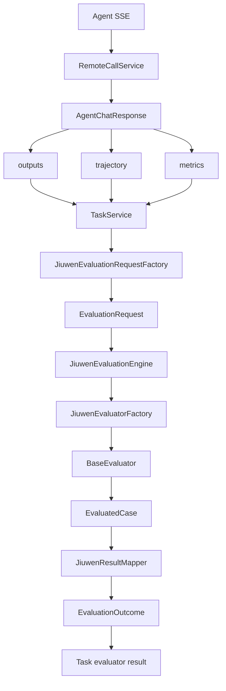
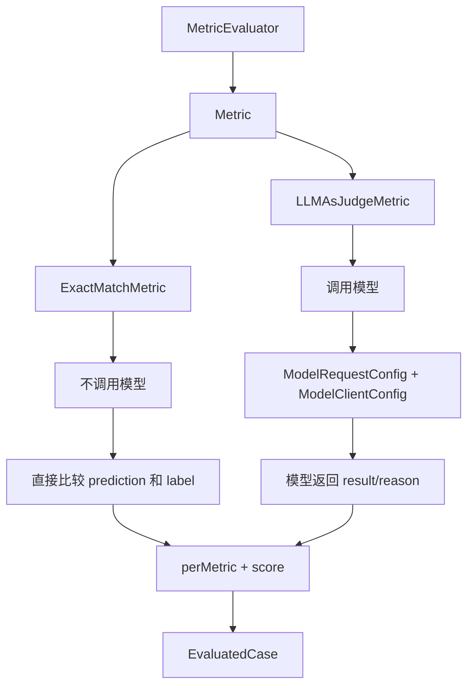
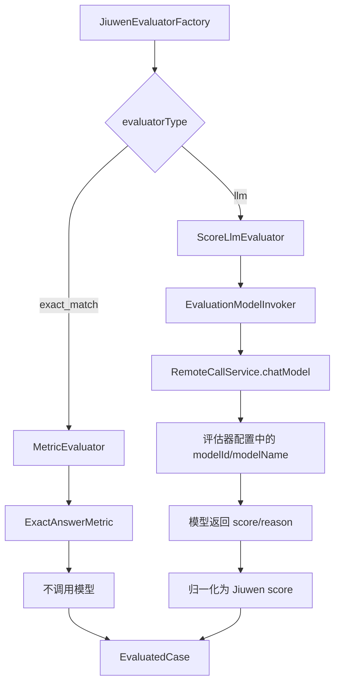

# Jiuwen 评估接入架构

## 总体链路



## Jiuwen 原生评估器分层

`MetricEvaluator` 不是专门的 LLM 评估器，它是 Jiuwen 原生的通用 Metric 执行器。真正是否调用模型，取决于它包进去的 `Metric`。



所以 Jiuwen 原生有两类 Metric：

- 不调用模型：例如 `ExactMatchMetric`。
- 调用模型：例如 `LLMAsJudgeMetric`。

## 当前 Eval-System 接入路线

当前 Eval-System 已经接入两条路线：



这里 `llm` 没有直接使用 Jiuwen 原生 `LLMAsJudgeMetric`，原因是协议不同：

- Jiuwen 原生 `LLMAsJudgeMetric`：主要返回 `result/reason`，分数是 `0/1`。
- Eval-System 旧 LLM 评估器：要求返回 `score/reason`，分数区间可以是 `1~5`、`0~100` 等。

因此当前先用 `ScoreLlmEvaluator` 适配旧协议，保证历史评估器配置、prompt、分数区间和通过阈值不变。

## 模型边界

Jiuwen evaluator 不直接绑定模型来源。Eval-System 通过 `EvaluationModelInvoker` 把现有模型调用能力注入给 Jiuwen：

```text
evaluator.modelId + evaluator.modelName
  -> RemoteCallService.chatModel(...)
  -> ScoreLlmEvaluator
```

因此 Agent 执行模型和评估器模型仍然分离：

```text
Agent 模型：生成 Agent 答案
评估器模型：判断 Agent 答案质量并返回 score/reason
```

## 分数映射

`ScoreLlmEvaluator` 接收模型返回的原始分数，并转成 Jiuwen 的归一化分数：

```text
normalized = (score - scoreMin) / (scoreMax - scoreMin)
```

`JiuwenResultMapper` 再把归一化分数映射回 Eval-System 的原始分数区间，保持历史任务的分数语义不变。
